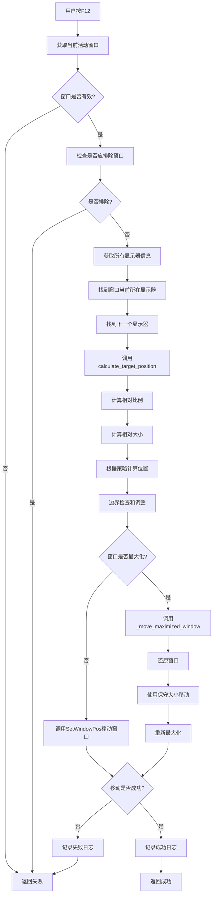

# 窗口跨屏移动功能 - 逻辑流程分析

> 版本: 1.0  
> 创建日期: 2024年  
> 分析对象: WindowManager.calculate_target_position()  

## 📋 当前实现的逻辑分析

### 🎯 核心问题

**您说得对！当前实现并没有真正做到"相对大小"**。让我详细分析当前的逻辑：

### 🔍 当前逻辑详解

#### 1. 相对比例计算 (第419-425行)
```python
# 计算窗口在当前显示器中的相对大小比例
relative_width_ratio = original_width / current_width    # 例如: 1020/1463 = 0.697 (69.7%)
relative_height_ratio = original_height / current_height # 例如: 697/914 = 0.763 (76.3%)

# 计算窗口在当前显示器中的相对位置比例  
relative_x_ratio = (x - current_x) / current_width       # 例如: (134-0)/1463 = 0.092 (9.2%)
relative_y_ratio = (y - current_y) / current_height      # 例如: (119-0)/914 = 0.130 (13.0%)
```

#### 2. 应用到目标显示器 (第427-429行)
```python
# 在目标显示器上应用相同的相对比例
scaled_width = int(target_width * relative_width_ratio)   # 3440 * 0.697 = 2398px
scaled_height = int(target_height * relative_height_ratio) # 1440 * 0.763 = 1099px
```

#### 3. 位置计算 (第449-454行)
```python
# relative策略: 使用相对位置比例
new_x = target_x + int(relative_x_ratio * target_width)   # -396 + (0.092 * 3440) = -79px
new_y = target_y + int(relative_y_ratio * target_height)  # -1440 + (0.130 * 1440) = -1253px
```

### ❌ 问题所在

1. **负坐标问题**: 目标显示器的工作区域起始坐标是负数 `(-396, -1440)`，导致计算出负坐标
2. **边界检查失效**: 虽然有边界检查，但逻辑不够完善
3. **最大化窗口处理**: 对最大化窗口使用了保守的固定大小 (1200x800)，没有使用相对大小

## 🔄 完整流程图



## 🧮 详细计算流程

```mermaid
flowchart TD
    A[开始位置计算] --> B[获取窗口原始尺寸]
    B --> C[获取当前显示器工作区]
    C --> D[获取目标显示器工作区]
    
    D --> E[计算相对宽度比例<br/>relative_width_ratio = original_width / current_width]
    E --> F[计算相对高度比例<br/>relative_height_ratio = original_height / current_height]
    F --> G[计算相对X位置比例<br/>relative_x_ratio = (x - current_x) / current_width]
    G --> H[计算相对Y位置比例<br/>relative_y_ratio = (y - current_y) / current_height]
    
    H --> I[应用相对大小到目标显示器<br/>scaled_width = target_width * relative_width_ratio<br/>scaled_height = target_height * relative_height_ratio]
    
    I --> J{选择的策略?}
    J -->|center| K[居中策略<br/>new_x = target_x + (target_width - scaled_width) / 2<br/>new_y = target_y + (target_height - scaled_height) / 2]
    J -->|relative| L[相对位置策略<br/>new_x = target_x + relative_x_ratio * target_width<br/>new_y = target_y + relative_y_ratio * target_height]
    J -->|smart| M{窗口是否过大?<br/>width > 80% 或 height > 80%}
    
    M -->|是| K
    M -->|否| L
    
    K --> N[边界检查]
    L --> N
    N --> O[调整过大的窗口]
    O --> P[确保位置在显示器内]
    P --> Q[最终验证和修正]
    Q --> R[返回新位置和大小]
```

## 🐛 当前问题分析

### 问题1: 负坐标计算
```
目标显示器工作区: (-396, -1440, 3044, 0)
target_x = -396, target_y = -1440

计算结果:
new_x = -396 + (0.092 * 3440) = -396 + 316 = -80px  ❌ 负数!
new_y = -1440 + (0.130 * 1440) = -1440 + 187 = -1253px ❌ 负数!
```

### 问题2: 最大化窗口处理不一致
```python
# 最大化窗口使用固定大小，没有使用相对大小计算
reasonable_width = min(width, 1200)  # 固定最大1200px
reasonable_height = min(height, 800)  # 固定最大800px
```

### 问题3: 边界检查逻辑缺陷
```python
# 当前的边界检查在负坐标情况下不够有效
new_x = max(target_x, min(new_x, target_right - scaled_width))
# 如果target_x是负数，max(target_x, new_x)仍然可能是负数
```

## ✅ 应该实现的正确逻辑

### 1. 修正的相对位置计算
```python
# 应该使用绝对坐标系，而不是显示器的工作区坐标
# 或者确保计算结果始终为正数

# 方案A: 使用显示器的绝对矩形而不是工作区
monitor_rect = target_monitor['rect']  # 而不是 work_area

# 方案B: 确保最终坐标为正数
new_x = max(0, target_x + int(relative_x_ratio * target_width))
new_y = max(0, target_y + int(relative_y_ratio * target_height))
```

### 2. 一致的相对大小处理
```python
# 最大化窗口也应该使用相对大小，而不是固定大小
# 在_move_maximized_window中也使用计算出的scaled_width和scaled_height
```

### 3. 改进的边界检查
```python
# 确保窗口完全在可见区域内
visible_left = max(0, target_x)
visible_top = max(0, target_y)
visible_right = min(screen_width, target_right)
visible_bottom = min(screen_height, target_bottom)
```

## 🎯 总结

**您的观察是正确的**：当前实现虽然计算了相对比例，但由于以下问题导致效果不佳：

1. **负坐标问题**: 多显示器环境中的坐标系统处理不当
2. **最大化窗口特殊处理**: 破坏了相对大小的一致性  
3. **边界检查不完善**: 没有正确处理负坐标情况

需要修复这些问题才能真正实现"保持窗口和屏幕的相对大小和位置"的目标。